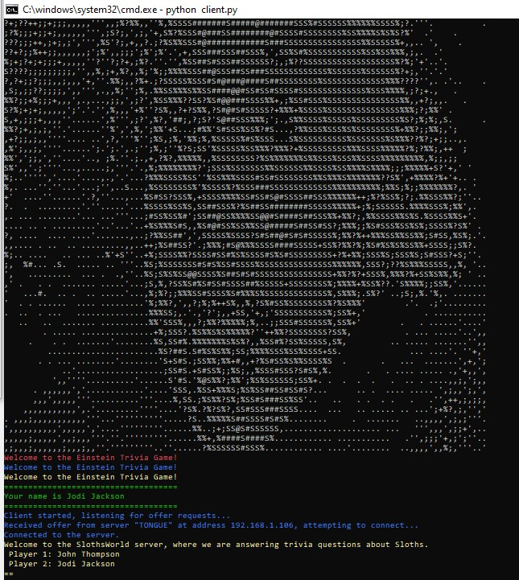

# TriviaKing

A **client-server multiplayer trivia game** that challenges players to answer true or false trivia questions about **Albert Einstein** as quickly as possible. Players join the game, receive trivia questions, and compete to answer correctly and win the game.

---



---

## Features

- **Multiplayer Mode**: Multiple clients can join the game server and compete against each other.
- **True/False Questions**: Trivia questions related to Albert Einstein, with answers validated in real-time.
- **Real-Time Communication**: Uses TCP and UDP protocols for smooth gameplay.
- **Randomized Trivia**: Questions are selected randomly for a fresh experience every time.
- **Statistics Tracking**: Keeps records of game stats, including player counts and popular answers.

---

## Project Structure

- **client.py**: The client-side application that connects to the server and handles user interactions.  
- **server.py**: The server-side application that manages game sessions and communicates with clients.  
- **game.py**: Contains game logic, including trivia question selection and game flow.  
- **stats.txt**: A log of game statistics, including questions asked and player responses.  

---

## How to Run

### Prerequisites
- Python 3.7 or higher
- Required libraries: `faker`, `keyboard`, `pynput`

Install dependencies:
```bash
pip install -r requirements.txt
### Running the Server
Start the server to host a game: python server.py
### Running the Client
Run the client to join the game: python client.py
Run at least two client screens.```

---

## Gameplay
1. **Join the Game**: Players discover the server via UDP broadcast and connect using TCP.
2. **Answer Questions**: The server sends trivia questions; players respond with "True" (T, Y, 1) or "False" (F, N, 0).
3. **Compete to Win**: The fastest and correct answer wins the round.
4. **Game Over**: Statistics are displayed at the end of the game

### Example Trivia Questions:
- "Albert Einstein was born in Germany." (True)
- "Einstein was awarded the Nobel Prize in Chemistry." (False)
- "Albert Einstein developed the theory of relativity." (True)

---

## Statistics
The game tracks:
- Most common questions.
- Hardest questions (no correct answers).
- Player participation count.

---

## Authors
- Shir Mordechai Rozenfeld
- Netta Meiri
